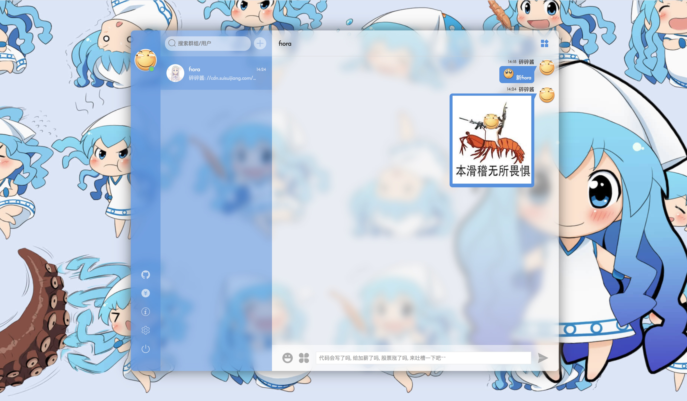

# Fiora

Language: [English](README.md) | [简体中文](./doc/README.ZH.md)

Fiora is a web chat application. It is written by node.js, mongodb, socket.io and react.

## Functions

0. Users, groups, private chat, group chat
0. Text, pictures, code, URL and many other types of messages
0. Desktop notification, sound reminder
0. Custom desktop background, theme color, and text color

## Script

* `server`: Start the server
* `client`: Start the client
* `build`: Building a release version of the client
* `lint`: Perform eslint check

## Run screenshot

## Directory structure

    |-- [build]                   // Webpack build
    |-- [client]                  // Client code
    |-- [config]                  // Config
    |-- [dist]                    // Packaging output directory
    |-- [doc]                     // Document
    |-- [public]                  // Static resources
    |-- [server]                  // Server code
    |-- [utils]                   // Util method
    |-- .babelrc                  // Babel config
    |-- .eslintignore             // Eslint ignore config
    |-- .eslintrc                 // Eslint rule config
    |-- .gitignore                // Git ignore config
    |-- .nodemonrc                // Nodemon config
    |-- package-lock.json         // npm
    |-- package.json              // npm
    |-- yarn.lock                 // yarn
    ...

## Contribution

If you want to add functionality or fix bugs, please follow the process below:

0. Fork this repository and clone the fork post to the local
0. Installation dependencies `yarn or npm install`
0. Modify the code and confirm it is bug free
0. Submit code, if eslint has reported error, please repair it and submit it again.
0. Create a pull request